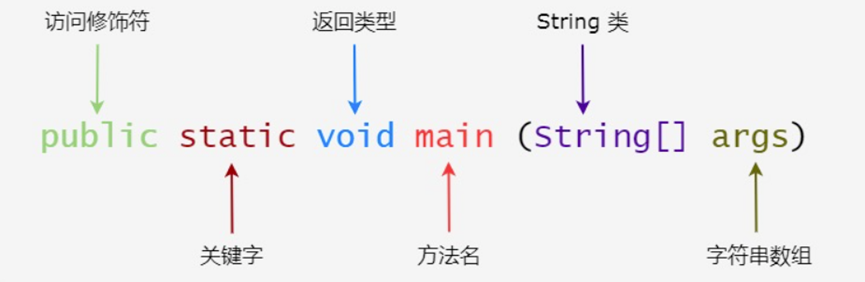

`Java 概述`
--

`程序 计算机执行某些操作或解决某个问题而编写的一系列有序指令的集合`

`Java 特点`
--

`1. Java 语言是面向对象的 OOP`

`2. Java 语言是健壮的 Java 的强类型机制、异常处理、垃圾的自动收集等是 Java 程序健壮性的重要保证`

`3. Java 语言是跨平台性的 即: 编译好的 .class 文件可以在多个系统下运行这种特性称为跨平台`

`4. Java 语言是解释型语言`

`解释性语言 javascript PHP java 编译性语言 c c++`

`区别` `解释性语言 编译后的代码 不能直接被机器执行需要解释器来执行编译性语言编译后的代码可以直接被机器执行`

`Java 运行机制`
--

`> Java 核心机制 Java 虚拟机 即 JVM`

`说明 因为有了 JVM 同一个 Java 程序在三个不同的操作系统中都可以执行这样就实现了 Java 程序的跨平台性`

`JVM 是一个虚拟的计算机 具有指令集并使用不同的存储区域 负责执行指令管理数据、内存、寄存器 包含在 JDK 中`

`对于不同的平台有不同的虚拟机 Java 虚拟机机制屏蔽了底层运行平台的差别实现了一次编译到处运行`

`JDK JRE`
--

`! JDK 的全称 JavaDevelopment Kit` `Java 开发工具包`

`JDK 是提供给 Java 开发人员使用的 其中包含了 java 的开发工具也包括了 JRE` 

`JDK = JRE + java 开发工具 java javac javadoc javap`

`! JRE Java Runtime Environment` `Java 运行环境`

`JRE 包括 Java 虚拟机 JVM Java Virtual Machine 和 Java 程序所需的核心类库等 如果想要运行一个开发好的 Java 程序计算机中只需要安装 JRE 即可`

`JRE = JVM + Java 的核心类库`

`下载安装 JDK` 
--

`官网` `https://www.oracle.com/java/technologies/javase-downloads.html`

`! 配置环境变量`

`JAVA_HOME 指向 jdk 安装目录` `编辑 path 增加 %JAVA_HOME%\bin` `检测：DOS命令行输入 java -version`

`Java 快速入门`
--

```java
public class Hello {
    public static void main(String[] args) {
        System.out.println("Hello World");
    }
}
```

`将 Java 代码编写到扩展名为 Hello.java 的文件中` 

`通过 javac 命令对该 java 文件进行编译生成 .class文件` 

`通过 java 命令对生成的 class 文件进行运行`



`Java 源文件以 .java 为扩展名源文件的基本组成部分是类` `.class 字节码文件`

`一个源文件中最多只能有一个 public 类 其它类的个数不限 主类名称与文件名称应保持一致 可以将 main 方法写任非 public 类中 然后指定运行非 public 类这样入口方法就是非 public 的 main 方法`

`注释` `comment` 
--

`> 介绍`

`注解说明解释程序的文字就是注释 被注释的的文字不会被 JVM 解释执行 注释提高了代码的阅读性可读性 注释是一个程序员必须要具有的良好编程习惯 将自己的思想通过注释先整理出来再用代码去体现`

`> Java 中的注释类型`

`单行注释 //` `多行注释 /* */` `文档注释 /** */`

`多行注释里面不允许有多行注释嵌套`

`> 注释规范`

`类、方法的注释要以 javadoc 的方式来写`

`非 JavaDoc 的注释 往往是给代码的维护者看的 着重告诉读者为什么这样写如何修改 注意什么问题等`
