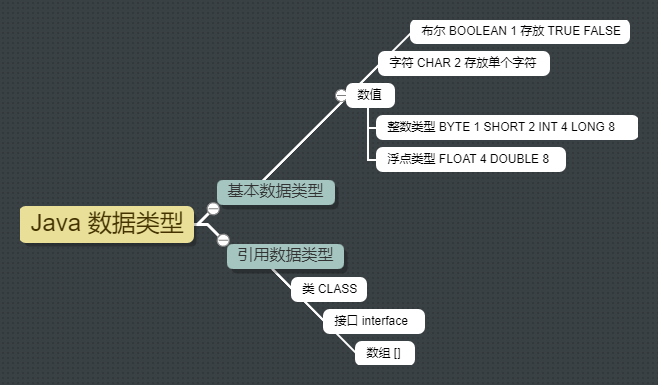
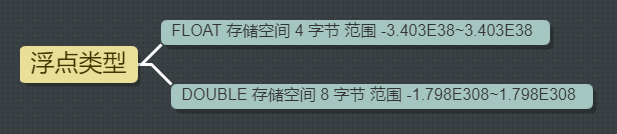
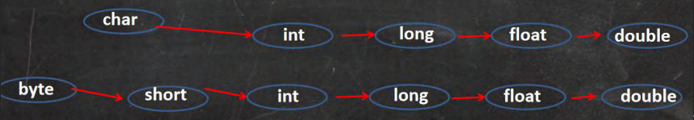
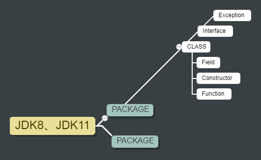

`变量`
--

`变量表示内存中的一个存储区域 不同的变量类型不同占用的空间大小不同` `变量必须先声明后使用` `值可以在同一类型范围内不断变化` `变量在同一个作用域内不能重名` `变量 = 变量名 + 值 + 数据类型`

`数据类型`
--

`每一种数据都定义了明确的数据类型 在内存中分配了不同大小的内存空间字节`

`Java 数据类型在很大程度上是独立于操作系统的 这得益于 Java 的设计哲学 即一次编写到处运行 Java 提供了一套标准的数据类型这些类型在所有 Java 虚拟机 JVM 实现中都是一致的 不论它们运行在什么操作系统上`



`基本数据类型`
--

`> 整型` `long v1 = 1l`


`> 浮点型` `1.0` `5.21 5.0f .5 5.1E2 5.1E-2` `float v1 = 1F` 



`浮点数在机器中存放形式的简单说明: 浮点数 = 符号位 + 指数位 + 尾数位` `尾数部分可能丢失造成精度损失 小数都是近似值`

`! 浮点陷阱` `直接查询得的的小数或者直接赋值可以判断相等`

```java
public class FloatTrap {
	public static void main(String[] args) {
		double v1 = 2.7;
		double v2 = 8.1 / 3;

		System.out.println(v1);
		System.out.println(v2);

		if(v1 == v2) {
			System.out.println("v1 == v2");
		}
		
		if(Math.abs(v1- v2) < 0.000001 ) {
		    System.out.println("-0.000001 < v1 - v2 < 0.000001");
		}
		
		System.out.println(Math.abs(v1- v2));
	}
}
```

`> 字符类型`

`字符类型是 CHAR 存储空间 2 字节 字符类型可以表示单个字符 可以存放汉字`

`字符常量是用单引号括起来的单个字符`

`转义字符特殊字符型常量` `\n` `\t` `\r`

`在 java 中 CHAR 的本质是一个整数 可以直接给 CHAR 赋一个整数然后输出时会按照对应的 unicode字符输出`

`CHAR 类型是可以进行运算的相当于一个整数  CHAR 类型可以保存 int 的常量值但不能保存 int 的变量值需要强转`

`> 布尔类型 boolean`

`booolean 存储空间 1 字节 类型数据只允许取值 true 和 false`

`基本数据类型转换`
--

`> 自动类型转换`

`当 java 程序在进行赋值或者运算时精度小的类型自动转换为精度大的数据类型这个就是自动类型转换`



`! 自动类型转换细节`

`多种类型的数据混合运算时系统首先自动将所有数据转换成容量最大的那种数据类型然后再进行计算`

`当我们把精度 容量 大的数据类型赋值给精度小的数据类型时就会报错反之就会进行自动类型转换`

`(BYTE SHORT) 和 CHAR 之间不会相互自动转换`

`BYTE SHORT CHAR 他们三者可以计算在计算时首先转换为int类型`

`boolean不参与转换`

`自动提升原则: 表达式结果的类型自动提升为操作数中最大的类型`

`> 强制类型转换`

`自动类型转换的逆过程 将容量大的数据类型转换为容量小的数据类型 使用时要加上强制转换符 但可能造成精度降低或溢出格外要注意` 

`强转符号只针对于最近的操作数有效往往会使用小括号提升优先级`

`JavaAPI 文档`
--

`JavaAPI 文档` `中文在线文档: https://www.matools.com`

`API Application Programming Interface 应用程序编程接口 是 Java 提供的基本编程接口` `Oracle 公司为这些基础类提供了相应的 API 文档用于告诉开发者如何使用这些类以及这些类里包含的方法`

`! Java 类组织形式`



`字符编码表`
--

`字符编码表是一种代码说明表格它规定了字符在计算机中的存储方式 通过字符编码表计算机可以将字符转换为二进制数据也可以将二进制数据转换回字符`

`编码转换 http://tool.chinaz.com/Tools/Unicode.aspx`

`! ASCII`

`适用范围 英文及部分特殊符号` `编码规则 一个字节中的 7 位表示一个字符 最高位为 0` `示例 字符 'A' 的 ASCII 码为 65 二进制表示为 01000001` `A = 97 - 32` `0 = 48` `'5' - 48 = 5`

`! ISO-8859-1`

`适用范围 拉丁语系字符` `编码规则 使用了一个字节中的 8 位 涵盖了更多的字符`

`! GB2312`

`适用范围 简体中文` `编码规则 使用两个字节表示一个字符 包含 6000~7000 个中文和符号` 

`! GBK`

`适用范围 简体中文 扩展了 GB2312 的字符集` `编码规则 同样使用两个字节表示一个字符 但字符集更加广泛 包含2万个中文和符号`

`! Unicode` `兼容 ASCII`

`适用范围 国际标准码表 涵盖了世界上几乎所有的文字` `编码规则 无论是什么文字 都用两个字节或更多存储 Unicode 码表为每种字符分配了一个唯一的编码 从而避免了字符集之间的冲突` `Java 中的 CHAR 类型就使用了这个码表`

`! UTF-8`

`适用范围 基于 Unicode 的变长字符编码` `编码规则 UTF-8 码表使用了 1~4 个字节不等来表示一个字符 其中常用的英文字符使用 1 个字节表示 而中文等复杂字符则使用多个字节表示 UTF-8 码表具有更高的效率并且在网络传输中更加节省带宽`
